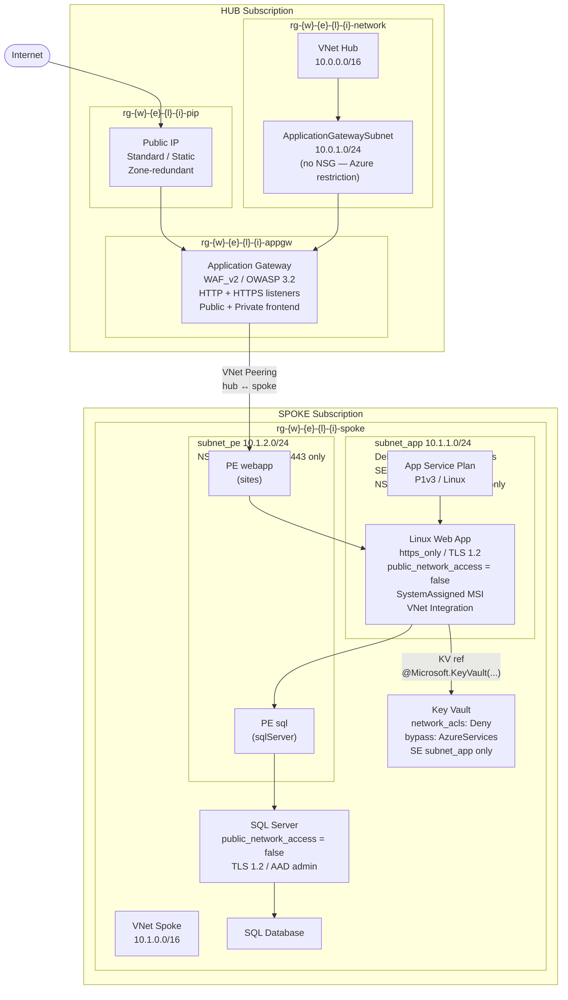

# Hub & Spoke — Azure Infrastructure (Terraform)

Hub & Spoke architecture on Azure using Terraform and the Cloud Adoption Framework naming convention. The hub hosts shared network services (Application Gateway WAF_v2); the spoke hosts the application workload (Web App, SQL, Key Vault, Private Endpoints).

## Architecture



**Legend:** `{w}` = workload, `{e}` = environment, `{l}` = location_short, `{i}` = instance

## Prerequisites

- Terraform `>= 1.5.0`
- Azure CLI authenticated (`az login`)
- Two Azure subscriptions: hub and spoke
- Minimum RBAC: `Contributor` on both subscriptions + `Network Contributor` on the hub network RG for the spoke service principal (cross-subscription peering)
- One Azure Storage Account per root module for remote state (can be the same account with different keys)

## Project structure

```
hub-spoke/
├── modules/naming/    # Shared CAF naming module — single source of truth
├── hub/               # Hub root module (AppGW, VNet, PIP)
├── spoke/             # Spoke root module (WebApp, SQL, KV, Private Endpoints)
└── README.md
```

## Deployment order

The hub must be deployed first. Spoke variables reference hub outputs.

### 1 — Deploy the hub

```bash
cd hub/

# Set sensitive variables
export TF_VAR_hub_subscription_id="xxxxxxxx-xxxx-xxxx-xxxx-xxxxxxxxxxxx"

# Init (backend.hcl must exist — see hub/README.md)
terraform init -backend-config=backend.hcl

terraform plan
terraform apply

# Save outputs for the spoke
terraform output
```

### 2 — Configure the spoke

Copy hub output values into `spoke/terraform.tfvars`:

```hcl
hub_vnet_name       = "<hub output: hub_vnet_name>"
hub_rg_network_name = "<hub output: hub_rg_network_name>"
hub_appgw_name      = "<hub output: appgw_name>"
hub_rg_appgw_name   = "<hub output: hub_rg_appgw_name>"
```

### 3 — Deploy the spoke

```bash
cd spoke/

export TF_VAR_spoke_subscription_id="xxxxxxxx-xxxx-xxxx-xxxx-xxxxxxxxxxxx"
export TF_VAR_hub_subscription_id="xxxxxxxx-xxxx-xxxx-xxxx-xxxxxxxxxxxx"
export TF_VAR_tenant_id="xxxxxxxx-xxxx-xxxx-xxxx-xxxxxxxxxxxx"
export TF_VAR_sql_admin_login="sqladmin"
export TF_VAR_sql_admin_password="P@ssw0rd!2024"
export TF_VAR_sql_connection_string_secret="Server=tcp:..."

terraform init -backend-config=backend.hcl
terraform plan
terraform apply
```

### 4 — Update hub backend pool

After the spoke is deployed, point the AppGW at the webapp Private Endpoint:

```bash
# Retrieve the webapp PE private IP
terraform -chdir=spoke output pe_webapp_private_ip

# Update hub/terraform.tfvars
backend_fqdns = ["<pe_webapp_private_ip>"]

# Re-apply hub
terraform -chdir=hub apply
```

## Sensitive variables

Never commit these values. Always pass via environment variables:

| Variable | Module | Description |
|----------|--------|-------------|
| `TF_VAR_hub_subscription_id` | hub + spoke | Hub Azure subscription ID |
| `TF_VAR_spoke_subscription_id` | spoke | Spoke Azure subscription ID |
| `TF_VAR_tenant_id` | spoke | Azure AD tenant ID |
| `TF_VAR_sql_admin_login` | spoke | SQL Server administrator login |
| `TF_VAR_sql_admin_password` | spoke | SQL Server administrator password |
| `TF_VAR_sql_connection_string_secret` | spoke | Full SQL connection string (stored in Key Vault) |

## Troubleshooting

Common errors and fixes are documented in `.claude/agents/debug.md`. Key patterns:

| Error | Likely cause | Fix |
|-------|-------------|-----|
| `Module not found: ../modules/naming` | `terraform init` not run after adding module | `terraform init -upgrade` |
| `Provider configuration not present` | Missing `provider = azurerm.hub` on cross-sub resource | Add explicit provider argument |
| `KeyVaultAlreadyExists` / soft-delete conflict | KV was deleted but still in soft-delete state | `az keyvault purge --name <kv> --location <region>` |
| `LinkedAuthorizationFailed` on peering | Hub SP lacks Network Contributor on hub network RG | `az role assignment create --role "Network Contributor" ...` |
| `Cycle: azurerm_linux_web_app / azurerm_key_vault_access_policy` | `access_policy` inline block used instead of separate resource | Use `azurerm_key_vault_access_policy` as a standalone resource |
| `PublicNetworkAccessDisabled` on AppGW backend | Backend FQDN is the public hostname, not the PE private IP | Set `backend_fqdns` to the webapp PE private IP |
