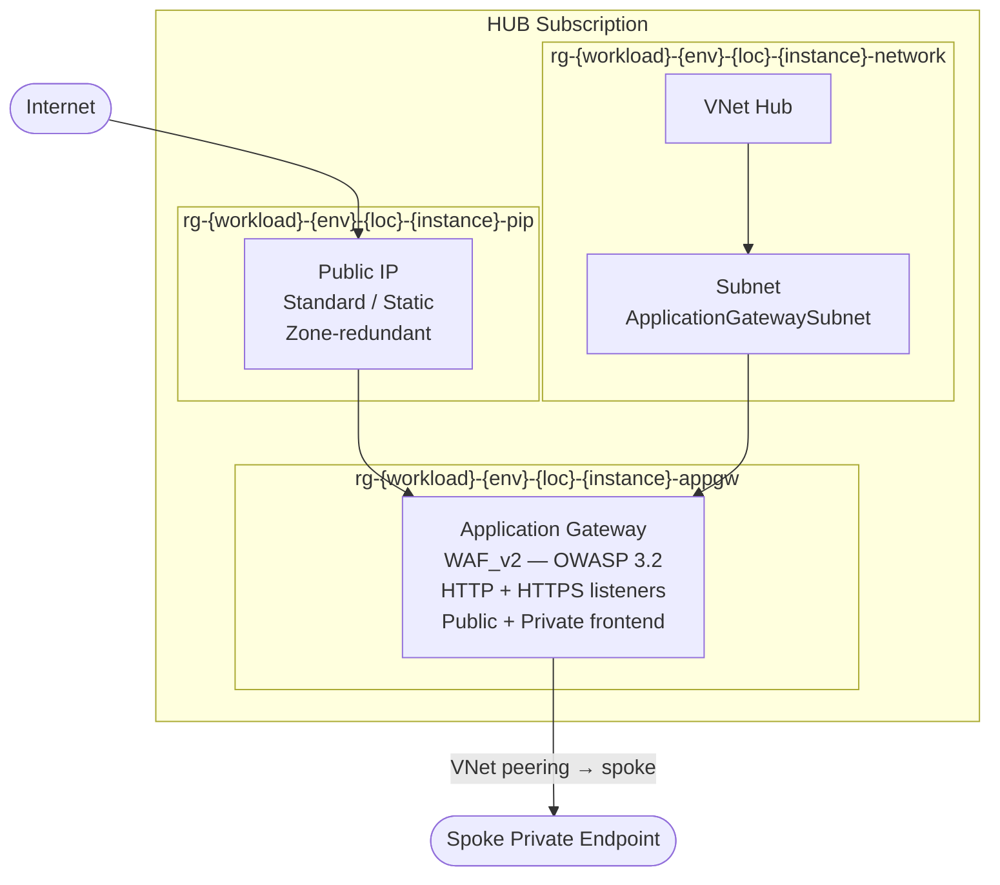

# Hub — Azure Hub & Spoke

Root module for the hub subscription. Deploys the shared network infrastructure: VNet, Application Gateway WAF_v2, and Public IP, across three dedicated resource groups.

## Architecture



## Deployment

```bash
# 1. Authenticate
az login
export TF_VAR_hub_subscription_id="xxxxxxxx-xxxx-xxxx-xxxx-xxxxxxxxxxxx"

# 2. Init with backend config
terraform init -backend-config=backend.hcl

# 3. Plan and apply
terraform plan
terraform apply

# 4. Retrieve outputs for the spoke
terraform output
```

`backend.hcl` (never commit):
```hcl
resource_group_name  = "rg-tfstate"
storage_account_name = "sttfstatehub001"
container_name       = "tfstate"
```

## Inputs

| Name | Type | Default | Sensitive | Description |
|------|------|---------|-----------|-------------|
| `hub_subscription_id` | `string` | — | yes | Azure subscription ID for the hub |
| `environment` | `string` | — | no | Deployment environment: dev, staging, prod |
| `location` | `string` | — | no | Azure region (e.g. francecentral) |
| `location_short` | `string` | — | no | Short region code (e.g. frc) |
| `workload` | `string` | — | no | Lowercase alphanumeric workload identifier |
| `instance` | `string` | — | no | 3-digit instance number (e.g. 001) |
| `hub_vnet_address_space` | `list(string)` | — | no | Hub VNet address space |
| `hub_subnet_appgw_prefix` | `string` | — | no | ApplicationGatewaySubnet CIDR |
| `pip_zones` | `list(string)` | `["1","2","3"]` | no | Public IP availability zones |
| `appgw_private_ip` | `string` | — | no | Static private IP for AppGW frontend |
| `capacity_min` | `number` | `1` | no | AppGW min autoscale capacity |
| `capacity_max` | `number` | `10` | no | AppGW max autoscale capacity |
| `waf_mode` | `string` | `"Prevention"` | no | WAF mode: Detection or Prevention |
| `waf_rule_set_version` | `string` | `"3.2"` | no | OWASP rule set version |
| `backend_fqdns` | `list(string)` | `[]` | no | Backend FQDNs (spoke webapp PE). Can be empty at initial deployment. |
| `cookie_affinity` | `string` | `"Disabled"` | no | AppGW cookie-based affinity |
| `request_timeout` | `number` | `30` | no | Backend request timeout (seconds) |
| `require_sni` | `bool` | `false` | no | Require SNI on HTTPS listener |
| `ssl_certificate_key_vault_id` | `string` | `""` | no | Key Vault secret ID for SSL cert. Leave empty to skip HTTPS listener. |
| `managed_identity_ids` | `list(string)` | `[]` | no | User Assigned Identity IDs for AppGW (Key Vault cert access) |
| `tags` | `map(string)` | `{}` | no | Tags applied to all resources |

## Outputs

| Name | Description |
|------|-------------|
| `hub_vnet_id` | Resource ID of the hub VNet |
| `hub_vnet_name` | Name of the hub VNet |
| `hub_subnet_appgw_id` | Resource ID of the ApplicationGatewaySubnet |
| `hub_rg_network_name` | Name of the hub network resource group |
| `hub_rg_appgw_name` | Name of the AppGW resource group |
| `hub_rg_pip_name` | Name of the PIP resource group |
| `appgw_id` | Resource ID of the Application Gateway |
| `appgw_name` | Name of the Application Gateway |
| `appgw_backend_address_pool_id` | Resource ID of the default backend address pool |
| `appgw_private_ip` | Private IP of the AppGW frontend |
| `pip_appgw_address` | Public IP address of the Application Gateway |
