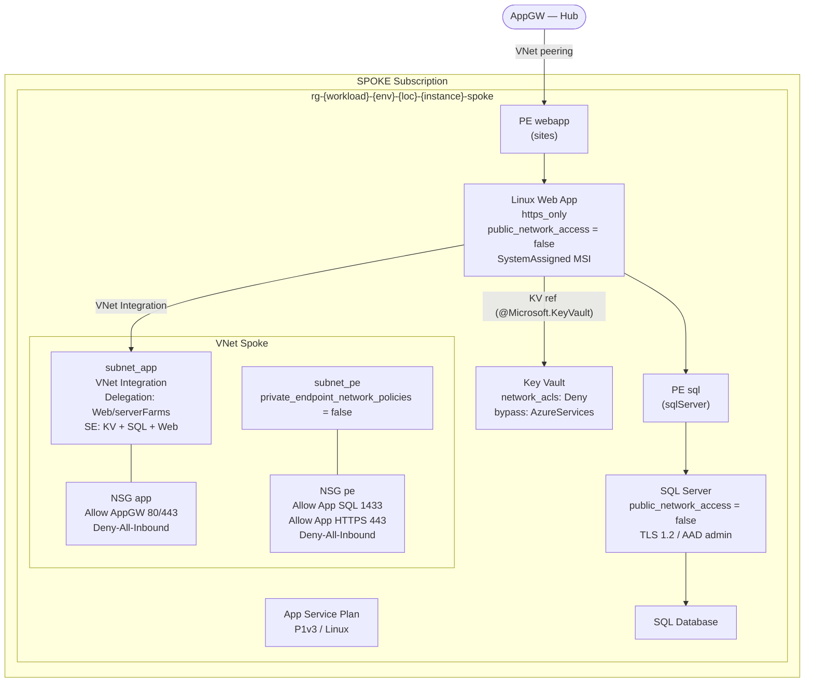

# Spoke — Azure Hub & Spoke

Root module for the spoke subscription. Deploys the application workload: VNet with peering, NSGs, Key Vault, SQL Server, Linux Web App with VNet integration, and Private Endpoints.

**Deploy after the hub.** Hub outputs must be set in `terraform.tfvars` before running `terraform plan`.

## Architecture



## Traffic flow

```
Internet → AppGW WAF_v2 (hub)
  → [VNet peering]
    → PE webapp (subnet_pe)
      → Linux Web App (subnet_app via VNet Integration)
        ├→ Key Vault (service endpoint on subnet_app)
        └→ PE SQL (subnet_pe)
             → Azure SQL Server
```

## Deployment

```bash
# 1. Retrieve hub outputs
terraform -chdir=../hub output

# 2. Set hub values in terraform.tfvars (non-sensitive) and TF_VAR_* (sensitive)
export TF_VAR_spoke_subscription_id="xxxxxxxx-xxxx-xxxx-xxxx-xxxxxxxxxxxx"
export TF_VAR_hub_subscription_id="xxxxxxxx-xxxx-xxxx-xxxx-xxxxxxxxxxxx"
export TF_VAR_tenant_id="xxxxxxxx-xxxx-xxxx-xxxx-xxxxxxxxxxxx"
export TF_VAR_sql_admin_login="sqladmin"
export TF_VAR_sql_admin_password="P@ssw0rd!2024"
export TF_VAR_sql_connection_string_secret="Server=tcp:..."

# 3. Init with backend config
terraform init -backend-config=backend.hcl

# 4. Plan and apply
terraform plan
terraform apply
```

`backend.hcl` (never commit):
```hcl
resource_group_name  = "rg-tfstate"
storage_account_name = "sttfstatespoke001"
container_name       = "tfstate"
```

## Inputs

| Name | Type | Default | Sensitive | Description |
|------|------|---------|-----------|-------------|
| `spoke_subscription_id` | `string` | — | yes | Azure subscription ID for the spoke |
| `hub_subscription_id` | `string` | — | yes | Azure subscription ID for the hub |
| `tenant_id` | `string` | — | yes | Azure AD tenant ID |
| `environment` | `string` | — | no | dev, staging, prod — must match hub |
| `location` | `string` | — | no | Azure region |
| `location_short` | `string` | — | no | Short region code — must match hub |
| `workload` | `string` | — | no | Workload identifier — must match hub |
| `instance` | `string` | — | no | 3-digit instance — must match hub |
| `hub_vnet_name` | `string` | — | no | Hub VNet name (from hub output) |
| `hub_rg_network_name` | `string` | — | no | Hub network RG name (from hub output) |
| `hub_appgw_name` | `string` | — | no | Hub AppGW name (from hub output) |
| `hub_rg_appgw_name` | `string` | — | no | Hub AppGW RG name (from hub output) |
| `hub_subnet_appgw_prefix` | `string` | — | no | AppGW subnet CIDR for NSG rules |
| `spoke_vnet_address_space` | `list(string)` | — | no | Spoke VNet address space |
| `spoke_subnet_app_prefix` | `string` | — | no | App subnet CIDR |
| `spoke_subnet_pe_prefix` | `string` | — | no | PE subnet CIDR |
| `private_dns_zone_sql_id` | `string` | `""` | no | Private DNS Zone ID for SQL |
| `private_dns_zone_webapp_id` | `string` | `""` | no | Private DNS Zone ID for webapp |
| `key_vault_sku` | `string` | `"standard"` | no | Key Vault SKU |
| `kv_soft_delete_days` | `number` | `90` | no | KV soft-delete retention days |
| `kv_purge_protection` | `bool` | `true` | no | Enable KV purge protection |
| `kv_allowed_ips` | `list(string)` | `[]` | no | Additional IPs for KV network ACLs |
| `sql_connection_string_secret` | `string` | `""` | yes | SQL connection string (stored in KV) |
| `sql_admin_login` | `string` | — | yes | SQL administrator login |
| `sql_admin_password` | `string` | — | yes | SQL administrator password |
| `sql_aad_admin_login` | `string` | — | no | Azure AD SQL admin display name |
| `sql_aad_admin_object_id` | `string` | — | no | Azure AD SQL admin object ID |
| `sql_server_version` | `string` | `"12.0"` | no | SQL Server version |
| `sql_db_sku_name` | `string` | `"GP_Gen5_2"` | no | SQL Database SKU |
| `sql_max_size_gb` | `number` | `32` | no | SQL Database max size (GB) |
| `asp_os_type` | `string` | `"Linux"` | no | App Service Plan OS type |
| `asp_sku_name` | `string` | `"P1v3"` | no | App Service Plan SKU |
| `tags` | `map(string)` | `{}` | no | Tags applied to all resources |

## Outputs

| Name | Description |
|------|-------------|
| `spoke_vnet_id` | Resource ID of the spoke VNet |
| `spoke_vnet_name` | Name of the spoke VNet |
| `rg_spoke_name` | Name of the spoke resource group |
| `webapp_hostname` | Default hostname of the Web App |
| `webapp_principal_id` | MSI principal ID of the Web App |
| `sql_server_fqdn` | FQDN of the SQL Server |
| `key_vault_uri` | URI of the Key Vault |
| `pe_webapp_private_ip` | Private IP of the webapp private endpoint |
| `pe_sql_private_ip` | Private IP of the SQL private endpoint |

## Post-deployment: update hub backend pool

After the spoke is deployed, update the hub's AppGW backend pool with the webapp PE private IP:

```bash
# In spoke/
terraform output pe_webapp_private_ip

# In hub/terraform.tfvars
backend_fqdns = ["<pe_webapp_private_ip>"]

# Re-apply hub
terraform -chdir=../hub apply
```
